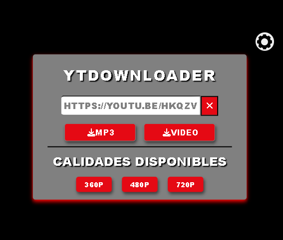

# YouTube Downloader App (con Eel y python)
Programa de escritorio hecho con en python + Eel para descargar videos o música de YouTube. Ideal para uso personal, sin complicaciones.

## Caracteristicas
- Interfaz gráfica con HTML/CSS/JS
- Descargar música en formato MP3.
- Descargar videos en distintas resoluciones (seleccionables).
- Elegir carpeta de descarga (guardada en configuración).
- Notificación visual al completar una descarga.
- Opción para evitar descargas masivas accidentales.

